# GameVault – Customer Purchase Workflow

> Production-grade workflow for the GameVault e-commerce platform.

```mermaid
flowchart TD

%% =========================
%% STYLES
%% =========================
classDef process fill:#E3F2FD,stroke:#1565C0,stroke-width:1.5px,color:#000;
classDef decision fill:#FFF3E0,stroke:#EF6C00,stroke-width:1.5px,color:#000;
classDef success fill:#E8F5E9,stroke:#2E7D32,stroke-width:1.5px,color:#000;
classDef danger fill:#FFEBEE,stroke:#C62828,stroke-width:1.5px,color:#000;

%% =========================
%% CUSTOMER FLOW
%% =========================

A([🚀 Start])

A --> B[🛍 Browse Products]

B --> C[🎮 View Product Details]

C --> D{Add Product to Cart?}

D -->|Yes| E[🛒 Store Item in Guest Cart]

D -->|No| B

E --> F[🔍 Continue Shopping]

F --> G{Proceed to Checkout?}

G -->|No| B

G -->|Yes| H{User Logged In?}

H -->|No| I[🔐 Login / Register]

I --> J[🔄 Merge Guest Cart with User Cart]

H -->|Yes| K[📦 Load User Cart]

J --> L[🧾 Checkout]

K --> L

L --> M[📍 Select Shipping Address]

M --> N{Choose Payment Method}

%% =========================
%% PAYMENT FLOW
%% =========================

N -->|Cash on Delivery| O[💵 COD Selected]

N -->|Online Payment| P[💳 Process Online Payment]

P --> Q{Payment Successful?}

Q -->|No| R[❌ Payment Failed]

R --> N

Q -->|Yes| S[📑 Create Order]

O --> S

%% =========================
%% ORDER FLOW
%% =========================

S --> T[📉 Update Inventory]

T --> U{Stock Available?}

U -->|No| V[⚠ Notify Out of Stock]

U -->|Yes| W[🆔 Generate Order Number]

W --> X[📧 Send Email Confirmation]

X --> Y[📱 Send SMS Confirmation]

Y --> Z[📋 Admin Receives New Order]

%% =========================
%% ADMIN FLOW
%% =========================

Z --> AA[📦 Process Order]

AA --> AB[📦 Pack Products]

AB --> AC[🚚 Ship Order]

AC --> AD[📍 Update Tracking Status]

AD --> AE[📲 Notify Customer]

AE --> AF[✅ Order Delivered]

AF --> AG[⭐ Request Customer Review]

AG --> AH([🏁 End])

%% =========================
%% NODE STYLING
%% =========================

class B,C,E,F,I,J,K,L,M,O,P,S,T,W,X,Y,Z,AA,AB,AC,AD,AE,AF,AG process
class D,G,H,N,Q,U decision
class AH success
class R,V danger
```

---

## Workflow Summary

### Customer

- Browse products
- View product details
- Add items to guest cart
- Continue shopping
- Checkout
- Login/Register only when required
- Select shipping address
- Choose payment method
- Place order

### Payment

- Cash on Delivery
- Online Payment
- Retry payment if unsuccessful

### System

- Merge guest cart
- Create order
- Update inventory
- Generate unique order number
- Send Email
- Send SMS

### Admin

- Receive order
- Process order
- Pack items
- Ship order
- Update tracking

### Customer After Shipment

- Receive tracking updates
- Receive delivered notification
- Leave review & rating

---

## Legend

| Shape | Meaning |
|--------|---------|
| Rectangle | Process |
| Diamond | Decision |
| Rounded Rectangle | Start / End |
| Green | Success |
| Red | Error / Failure |
| Blue | System Process |
| Orange | Decision Point |